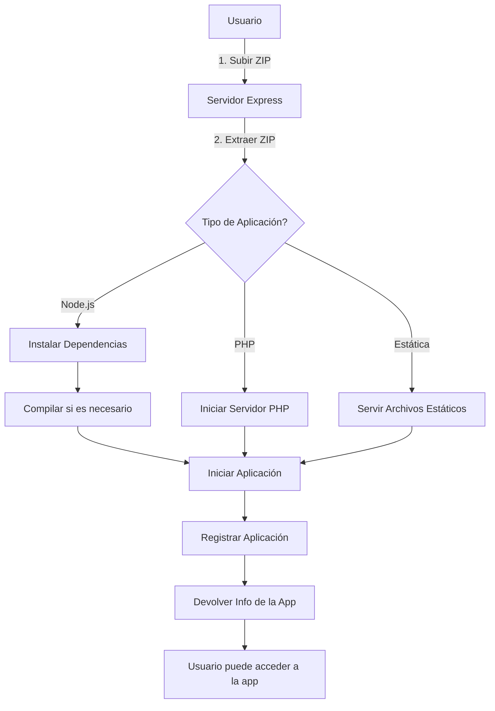
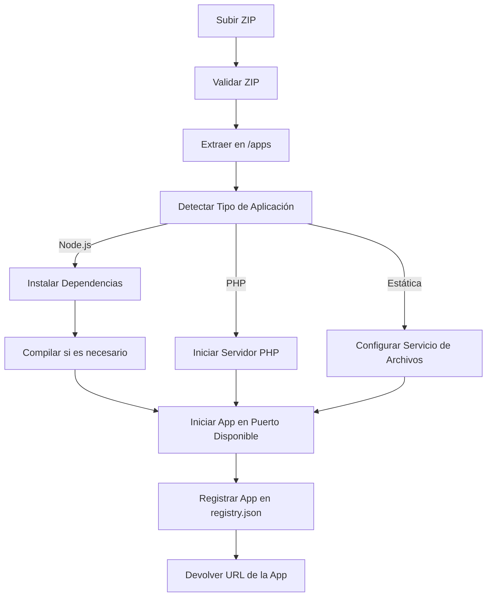
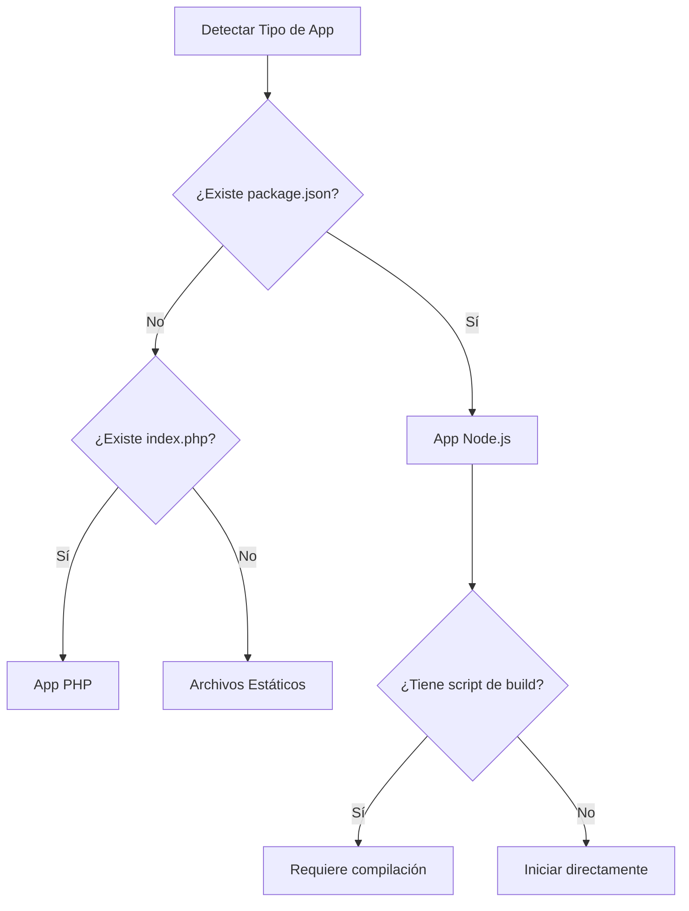

# Documentación Técnica: Aplicación Modular de Despliegue

## Tabla de Contenidos
1. [Visión General](#visión-general)
2. [Diagramas de Flujo](#diagramas-de-flujo)
   - [Flujo Principal](#flujo-principal)
   - [Procesamiento en el Servidor](#procesamiento-en-el-servidor)
   - [Detección de Aplicaciones](#detección-de-aplicaciones)
3. [Arquitectura](#arquitectura)
   - [Estructura del Proyecto](#estructura-del-proyecto)
   - [Componentes Principales](#componentes-principales)
4. [Decisiones de Diseño](#decisiones-de-diseño)
   - [Frontend Dual](#frontend-dual)
   - [Sistema de Registro](#sistema-de-registro)
   - [Barra Lateral de Navegación](#barra-lateral-de-navegación)
5. [Características Técnicas](#características-técnicas)
6. [Despliegue y Uso](#despliegue-y-uso)
7. [Mantenimiento](#mantenimiento)
8. [Futuras Mejoras](#futuras-mejoras)

## Visión General

Esta aplicación es un sistema modular de despliegue que permite implementar, gestionar y ejecutar diferentes tipos de aplicaciones web de manera centralizada. Soporta aplicaciones Node.js, PHP y contenido estático, manejando automáticamente dependencias, puertos y ciclo de vida de las aplicaciones.

## Diagramas de Flujo

### Flujo Principal



### Procesamiento en el Servidor



### Detección de Aplicaciones



## Arquitectura

### Estructura del Proyecto

```
aplicacion-modulos/
├── client/               # Frontend principal
│   ├── src/             # Código fuente
│   └── public/          # Archivos estáticos
├── server/              # Backend (Node.js/Express)
│   └── index.js         # Punto de entrada del servidor
├── apps/                # Módulos de prueba
│   ├── reactapp/        # Pruebas con React
│   └── wsvelte/         # Pruebas con Svelte
└── registry.json        # Registro de aplicaciones
```

### Componentes Principales

1. **Frontend Principal (`/client`)**
   - Interfaz de usuario principal
   - Panel de control administrativo
   - Visualización de métricas
   - Gestión de aplicaciones

2. **Servidor (`/server`)**
   - Maneja la carga de archivos
   - Extrae archivos ZIP
   - Detecta el tipo de aplicación
   - Gestiona el ciclo de vida de las aplicaciones
   - Provee la API REST

3. **Módulos de Prueba (`/apps`)**
   - Contiene aplicaciones de prueba
   - Usado para desarrollo y pruebas
   - Incluye ejemplos en React y Svelte

## Decisiones de Diseño

### Arquitectura del Frontend

**Implementación**: Aplicación principal en `/client` con módulos de prueba en `/apps`.

**Ventajas**:
- Separación clara entre código de producción y pruebas
- Facilita el desarrollo de nuevas características
- Permite probar diferentes enfoques sin afectar el código principal
- Mantiene el código de producción limpio y enfocado

### Sistema de Registro

**Implementación**: Archivo `registry.json` centralizado.

**Beneficios**:
- Persistencia entre reinicios
- Fácil respaldo
- Sencillo de depurar
- Ligero y rápido

### Barra Lateral de Navegación

**Implementación**: Barra lateral fija con acceso rápido.

**Características**:
- Navegación intuitiva
- Estado visible del sistema
- Diseño responsivo
- Acceso rápido a funciones

## Características Técnicas

- **Soporte Multiplataforma**: Node.js, PHP y contenido estático
- **Gestión Automática de Dependencias**: npm, yarn, pnpm
- **Asignación Dinámica de Puertos**
- **Detección Automática de Tipo de Aplicación**
- **Sistema de Logs Integrado**
- **API RESTful**

## Despliegue y Uso

1. **Requisitos**:
   - Node.js 14+
   - npm o yarn
   - PHP (para aplicaciones PHP)

2. **Instalación**:
   ```bash
   # Instalar dependencias
   cd server
   npm install
   
   # Iniciar servidor
   npm start
   ```

3. **Uso**:
   - Acceder a la interfaz web
   - Subir archivo ZIP de la aplicación
   - Seguir las instrucciones en pantalla

## Mantenimiento

### Monitoreo
- Verificar logs del servidor
- Monitorear uso de recursos
- Revisar estado de aplicaciones

### Resolución de Problemas
1. Verificar logs de la aplicación
2. Revisar conexiones de red
3. Validar configuración
4. Revisar permisos de archivos

## Futuras Mejoras

1. **Escalabilidad**:
   - Balanceo de carga
   - Despliegue en múltiples servidores

2. **Seguridad**:
   - Autenticación
   - Aislamiento con contenedores
   - Certificados SSL

3. **Monitoreo**:
   - Métricas en tiempo real
   - Alertas automáticas
   - Dashboard de rendimiento

4. **Interfaz de Usuario**:
   - Panel de control unificado
   - Gráficos y estadísticas
   - Editor de configuración visual

---

*Documentación generada automáticamente - Última actualización: Septiembre 2025*
